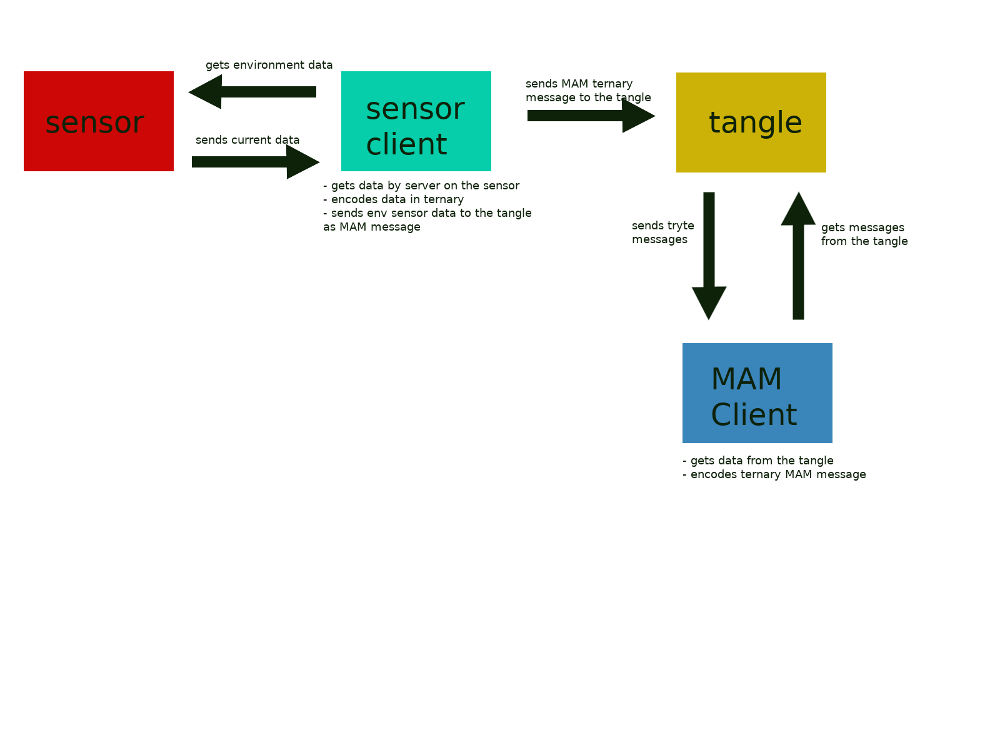

# Environment sensor to tangle
**In this guide, we are going to run an application 
which collects environment sensor data and sends it to the tangle via MAMv1**

## Prerequisites

- [Configured 6LoWPAN network](../../../general/0.1/how-to-guides/set-up-a-bluetooth-star-network.md)
- [Installed Bazel](https://docs.bazel.build/versions/master/install.html)

## Architecture



## How to

1. Start the server on your microcontroller
    
    You need to execute the following command in the serial console on your microcontroller.
    The shell terminal of your microcontroller is opened in the terminal where you executed ```make flash term```
    
    Execute the following command:
    
    ```bash
    server start
    ```
    
2. Clone the environment sensor client and MAM writer

```bash
git clone git@github.com:iota-community/env-sensor-mam-writer.git
```

3. Change the configuration

Before you run the application, you might need to some variables in app/server-client.c

IOTA_SEED contains a default seed. You should change it to your own seed. This seed should not contain any IOTA tokens.

``CLIENT_ADDRESS`` contains the IPv6 client address as hex array. 
In my case the address ``fe80::f2d5:bfff:fe10:f1b1`` becomes to 
``{ 0xfe, 0x80, 0x00, 0x00, 0x00, 0x00, 0x00, 0x00, 0xf2, 0xd5, 0xbf, 0xff, 0xfe, 0x10, 0xf1, 0xb1 }``
The university of Iowa has a [good explanation how the IPv6 addressing works.](https://its.uiowa.edu/support/article/1209)
The IPv6 must be assigned to network interface you want to use. 

The variable ``SENSOR_ADDRESS`` contains the IPv6 address of the sensor node.
Execute the command ``ifconfig`` on the shell of your sensor node, in order to get the correct IP address.

4. Run the environment sensor server

You need to execute the following command on the sensor shell:
```bash
server start
```

5. Run the writer application

```bash
cd env-sensor-mam-writer &&  bazel run -c opt //app
```

The application will request the environment data from the give sensor. 
The data will be written into a MAM channel. The writer application logs the address and bundle.
You need to notice these values, in order to receive your message. 

6. Clone the reader application

```bash
git clone git@github.com:iota-community/env-sensor-mam-reader.git
```

7. Change the configuration in the reader application

Change ``IOTA_ADDRESS`` and ``IOTA_BUNDLE`` to the values logged by the writer application.

8. Run the reader application

```bash
cd env-sensor-mam-reader && bazel run -c opt //app
```

The application logs the written temperature. 
