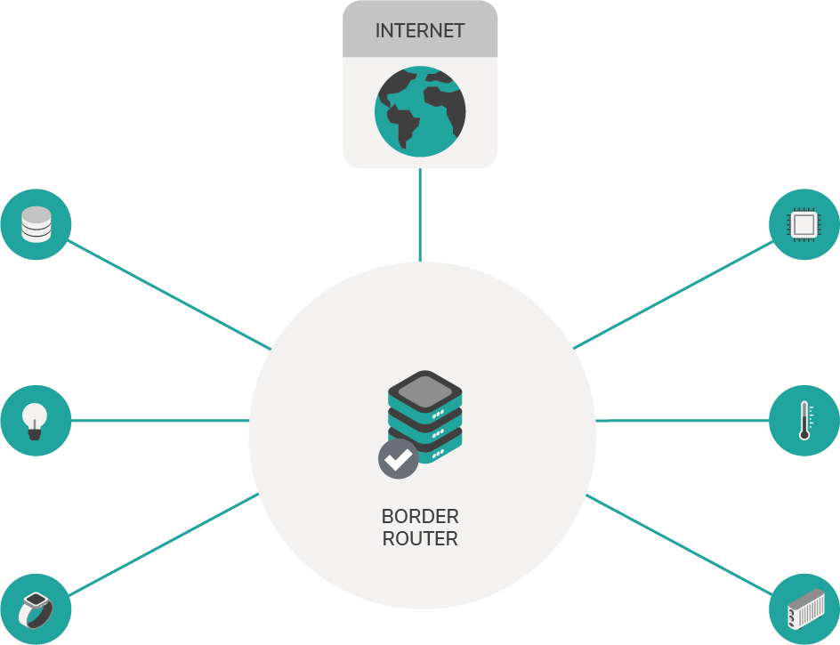

# 6LoWPAN mesh network

**This document contains some definitions and naming conventions of IoT 6LoWPAN mesh networks**

## Network stack

### IPv6 over Bluetooth Low Energy

### 6LoWPAN

## Network topology

The network topology of a 6LoWPAN network is really flexible. There are two types of network topologies used in 6LoWPAN.

### Star

The star topology is the simplest form of network topology. 
Routing is not needed, because all devices are directly communicating with the border router.
There is little routing involved when devices want to communicate with each other. 
The border router just acts as switch in this network topology.

### Mesh tree

There are a lot of different type of meshing topologies. 
6LoWPAN uses a mesh tree in order to use a simple routing algorithm.
The biggest problem in huge mesh networks is the routing. 
As more complex the mesh topology is, the more complex the routing becomes. 

## Routing

There are two types of routing protocols. Mesh-under and route-over.

## Mesh-under

Mesh-under describes a type of routing protocol which uses the Layer 2 (Mac Layer) for its routing. It is therefore similar to Ethernet. Mesh-under broadcasts the packets in the network. Mesh-under produces more load on the network than route-over.
Mesh-under protocols should only be used for smaller networks. 
Mesh-under has typically a lower latency than route-over.
Mesh-under routing has a disadvantage in scalability.

## Route-over

Route-over is a type of routing protocol which uses the Layer 3 (IP Layer) for its routing. 
Packets are not broadcasted. They are only send to the node in the radio range. 
Route-over requires knowledge about the neighbors. For example Neighbor Discovery can be used for it.
Due to the multicast packets, Route-over is giving the Neighbor Discovery protocol a disadvantage.
Route-over routing has a advantage in scalability.

## Naming convention

### LLN

LLN stands for low power and lossy networks. 
It describes a type of network where some devices might be not be available all the time. 
For example when a device only wakes up in a certain interval.
It also describes a network where a packet might get lost, due to unreliable devices.
The range of the radio can also play a role in it. 

### Host

Host describes a device which is not a router. In a mesh tree the host is a leaf node.

### Node

Node refers to any device in our network structure. This can either be a Host of a router.

### IEEE 802.15.4

[IEEE 802.15.4](https://standards.ieee.org/standard/802_15_4-2015.html) is the PHY and MAC layer for our 6LoWPAN network. 
The Direct Sequence Spread Spectrum modulation used in IEEE 802.15.4 
interferes less with other protocol on the same frequency. 

### 6LoWPAN

6LoWPAN stands for "IPv6 over Low power Wireless Personal Area Network" 
and describes a protocol which makes IPv6 packets more efficient and therefore usable for constraint devices.
It uses for example header compression to reduce the size of local IPv6 addresses.
IPv6 requires a MTU of at least 1280 bytes, but the IEEE 802.15.4 protocol has only a packet size of 127 bytes.
The 6LoWPAN layer uses transparent packet fragmentation to combine the IEEE 802.15.4 packets.
Keep in mind: If one of the IEEE 802.15.4 fragmentation is lost, the complete 6LoWPAN packet is lost.
Therefore, we should always keep the packets as small as possible. 
The standard is defined in 
[RFC 8025](https://datatracker.ietf.org/doc/rfc8025/), 
[RFC 6775](https://datatracker.ietf.org/doc/rfc6775/), 
[RFC 6282](https://datatracker.ietf.org/doc/rfc6282/), 
[RFC 8066](https://datatracker.ietf.org/doc/rfc8066/) 

### IPv6 over Bluetooth Low Energy

The IPv6 over Bluetooth Low Energy protocol uses 6LoWPAN techniques to enable IPv6 packets over
Bluetooth Low Energy. The standard is described in [RFC7668](https://datatracker.ietf.org/doc/rfc7668/). 
The standard utilizes the 
[IPSP characteristics](https://www.bluetooth.org/docman/handlers/DownloadDoc.ashx?doc_id=296307) in Bluetooth >= 4.1.
The complete IP standard on Bluetooth is defined in the [Bluetooth 4.2 specification](https://www.bluetooth.org/DocMan/handlers/DownloadDoc.ashx?doc_id=286439).

### RPL (IPv6 Routing Protocol for Low-Power and Lossy Networks)

RPL is a routing protocol used for 6LoWPAN. 
The standard is defined in [RFC 6550](https://datatracker.ietf.org/doc/rfc6550/).
[This video series](https://www.youtube.com/watch?v=6AP7p0sbBro&t=45s) is a good resource to get into details how it works.

### 6LBR (6LoWPAN border router)

Border router are connecting the 6LoWPAN with an IPv6 network.

The border router connects our IoT mesh network to the Internet. 
The border router is not necessarily connecting the mesh 6LoWPAN directly to the Internet.
The router can also be connected to a private or public WiFi.
Some resources refer it as edge router.

### 6LR (6LoWPAN router)

A 6LR routes the packets to hosts or other 6LR nodes. The only difference between a 6LBR and a 6LR is the connection to the Internet.

