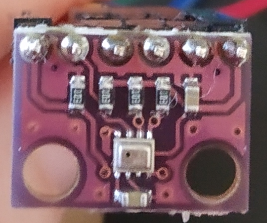

# Connect a Bosch BME/BMP 280 to your nRF52
**In this guide, we explain how to connect and use a Bosch BME/BMP 280 sensor**

:::info:
We are going to use a ready to use BME 280 module.
If you consider yourself as beginner, you should use a ready to use module.
If you want to use the BME/BMP 280 sensor directly, you take care about some things.
- [Pull SCL and SDA up and add a Pull-up resistor](https://electronics.stackexchange.com/a/1852/201179)
- [Connect CSB (chip select) to VDDIO.](https://ae-bst.resource.bosch.com/media/_tech/media/datasheets/BST-BMP280-DS001.pdf)
 (See "5.1 Interfaceselection" for more information)  
This selects the I2C interface. 
Pull low for selecting the SPI interface.
::

**BME 280 I2C board**

1. Solder the pin header to your BME 280 board

2. [Connect the I2C sensor to your nRF5](connect-a-I2C-sensor.md)

3. Connect SDO to VDDIO.

    :::info:
    This gives the BME/BMP 280 the [I2C device address 0x77.](https://ae-bst.resource.bosch.com/media/_tech/media/datasheets/BST-BMP280-DS001.pdf)
    (See "5.2 I²C Interface" for more information).
    If you want to use the BMP 180 and BME/BMP 280 together on one I2C bus, 
    you should pull SDO low, in order to avoid I2C address conflicts.
    If you do this, you have to change the I2C address in the RIOT configuration file bmx280_params.h
    :::

