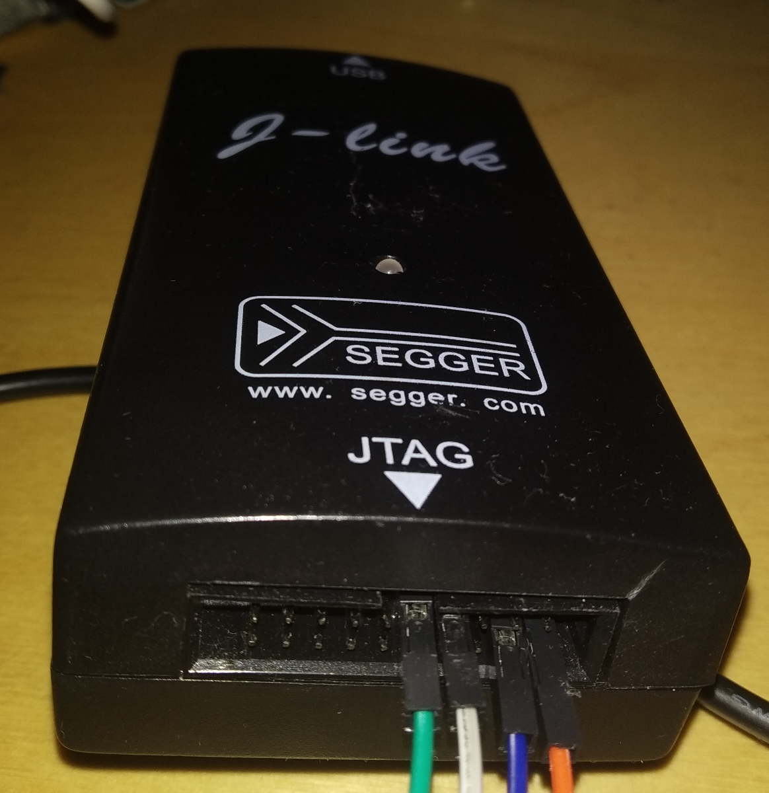
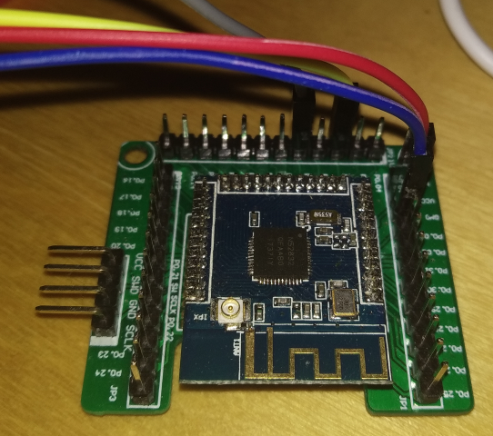
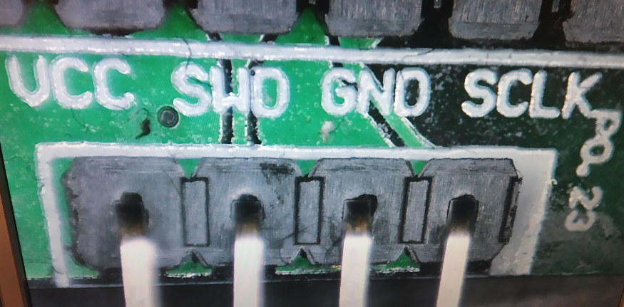

# Connect a J-Link and serial console to your nRF5x microcontroller

*In order to be able to flash your nRF5x microcontroller, you need to wire your J-Link to your nRF MCU.
This guide describes how you can do this.*

:::info:
If you want to have cheap option to flash a nRF5x microcontroller, you should consider buying a
J-Link OB clone. Some development boards have an integrated J-Link. 
If your board has an integrated one, you should use it. Check the documentation of your development board first.
:::

## Prerequisites

- External or integrated Segger J-Link
- nRF5x with development board
- DuPont Cables to connect the J-Link to your microcontroller
- UART-to-USB dongle
- DuPont Cables to connect the UART-to-USB dongle to your microcontroller

## J-Link pinout

The J-Link uses a standard 20 PIN JTAG.

## J-Link OB clone pinout

## nRF5x pinout
:::info:
The pinout depends on the development used.
The cheap breakout board can be bought for ~2-3USD from China.
Just search for "nrf52832 Minimum Test Board" or "nrf51822 Minimum Test Board" 
This breakout board is compatible with the nrf51822 and nrf52832.
If you are going to use the breakout board, you need a compatible microcontroller module with 1.27mm pitch
:::

These are the pins we need to program the microcontroller.

These pins are used to connect our UART-to-USB dongle.

## UART-to-USB pinout

:::info:
You should use a black cable for GND and a red one for VCC
:::

1. Connect the Programmer to your development board
    - Option 1: J-Link
        
        |    nRF5x    |    J-Link (pin)   |
        |-------------|-------------------|
        |    VCC      |    VCC (1)        |
        |    GND      |    GND (4)        |
        |    SWD      |    SWDIO (7)      |
        |    SCLK     |    SWDCLK (9)     |
    
    - Option 2: J-Link OB
    
        |    nRF5x    |    J-Link OB   |
        |-------------|----------------|
        |    VCC      |    VCC         |
        |    GND      |    GND         |
        |    SWD      |    SWDIO       |
        |    SCLK     |    SWDCLK      |

    
2. Connect the UART-to-USB dongle to your microcontroller

    Connect P0.6 and P0.8.
    
    |    nRF5x (pin)   |    USB-to-UART   |
    |------------------|------------------|
    |    TX (P0.6)     |    RX            |
    |    RX (P0.8)     |    TX            |
    |    VCC           |    VCC           |
    |    GND           |    GND           |
