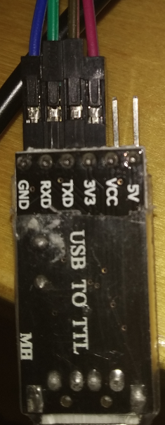

# Connect a J-Link and serial console to your nRF5x microcontroller

*In order to be able to flash your nRF5x microcontroller, you need to wire your J-Link to your nRF MCU.
This guide describes how you can do this.*

## Prerequisites

- Segger J-Link (alternative: an J-Link compatible clone or DIY build)
- nRF5x with development board
- DuPont Cables to connect the J-Link to your microcontroller
- UART-to-USB dongle
- DuPont Cables to connect the UART-to-USB dongle to your microcontroller

## J-Link pinout

The J-Link uses a standard 20 PIN JTAG.

## nRF5x pinout
::info
The cheap breakout board can be bought for ~2-3USD from China.
Just search for "nrf52832 Minimum Test Board" or "nrf51822 Minimum Test Board" 
This breakout board is compatible with the nrf51822 and nrf52832.
::

This depends on the development board you use.

These are the pins we need to program the microcontroller.

These pins are used to connect our UART-to-USB dongle.

## UART-to-USB pinout

::info
You should use a black cable for GND and a red one for VCC
::

1. Connect the J-Link to your development board
-
    Connect VCC, GND and SCLK to your J-Link
    
    |    nRF5x    |    J-Link (pin)   |
    |-------------|-------------------|
    |    VCC      |    VCC (1)        |
    |    GND      |    GND (4)        |
    |    SWD      |    SWDIO (7)      |
    |    SCLK     |    SWDCLK (9)     |
    
2. Connect the UART-to-USB dongle to your microcontroller

    Connect P0.6 and P0.8.
    
    |    nRF5x (pin)   |    USB-to-UART   |
    |------------------|------------------|
    |    TX (P0.6)     |    RX            |
    |    RX (P0.8)     |    TX            |
    |    VCC           |    VCC           |
    |    GND           |    GND           |
