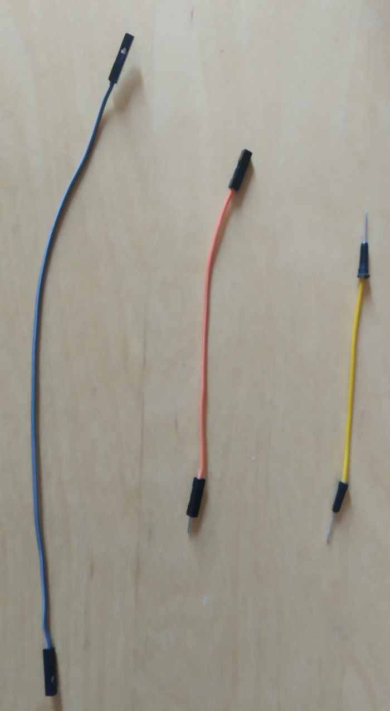
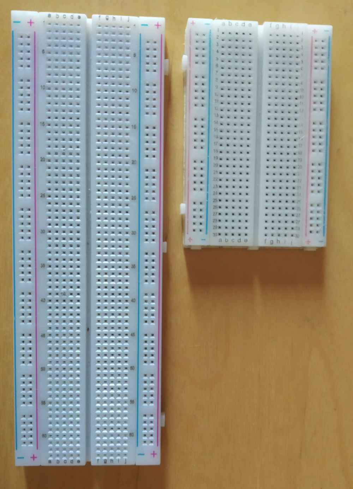
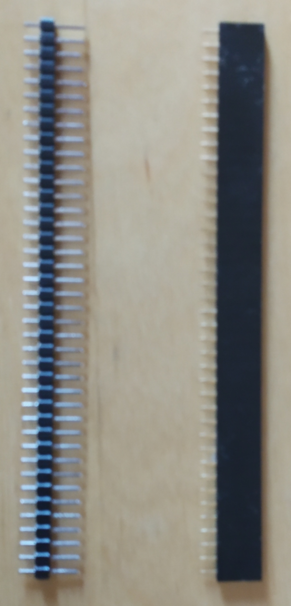

# Getting started with microcontroller development
**In this guide, you learn what you need in order to use and programm a microcontroller. Microcontroller are used in components like sensors**

1. Buy a nRF52 development board

    The nrf52 has an integrated IC. It is a cheap and powerful microcontroller. 
    This microcontroller is the choice for our guides. 
    When you get more familiar with microcontroller, you can switch to other microcontroller.
    
    There are a lot of choices for nrf52 based development boards.
    
    **List of available development boards:**
    
     - nRF52832 breakout board by Sparkfun @ ~20 USD
     - nRF52 DK @ ~40 USD
     - nRF52832-MDK @ ~30 USD (Staff pick)
     - nRF52832 USB Dongle @ ~10 USB
     - chinese nRF52832 module + nrf52832 Minimum Test Board @ ~10 USD (Staff pick)
    
    You can source these board from a specialized electronic retailers. 
    
2. Buy a Programmer

    A programmer is used to flash the code onto the microcontroller. 
    [Read more about the functionallity of a programmer.](https://www.engineersgarage.com/tutorials/microcontroller-programmer-burner)
    
    There are a lot of options for programmers. 
    Some microcontroller development boards have an integrated one. 
    The J-Link OB or DAPLink is often used as integrated programmer.
    If you picked a microcontroller dev board with an internal programmer, 
    you should check the technical documentation for your device. 
    If you bought a bare development board, you can buy a J-Link, J-Link or J-Link OB clone.
    If you use an external programmer, you need to [connect it to your development board.](connect-programmer-and-uart-adapter.md)
    
4. Buy an UART-to-USB-Adapter

    Similar to the programmer, some development boards have an integrated UART-to-USB-Controller.
    Check the technical documentation of your development board for the usage.
    If your board does not have one, you need an external adapter. 
    There are a lot of different options. 
    Just pick one which is available at your retailer and works for your operation system.
    
5. Optional: Buy DuPont cables, pin headers and breadboard

    This is not necessary for some boards. To be sure, we highly recommend to buy it.
    You might need it at some point.
    For example, if you try to connect more than one I2C sensor to one I2C port. 

    **DuPont cable**
    
    You can order DuPont cable usually in packs of 10, 20 etc.
    It is recommended to buy different ones in different sizes.
    
    
    
    From left to right: female-to-female, male-to-female, male-to-male
    
    **Breadboard**
    
    There are also different types of breadboards. These two are the most used ones.
    
    
    
    **Pin header**
    
    The most common used header are male-to-male. 
    It is simple to separate them into smaller parts with a nipper.
    
    
    
    From left to right: male-to-male, male-to-female
    
    
6. Optional: Buy an SBC

    This is not necessary, but recommended if you want to get a complete permanent usable setup.
    This is important, if you want to run your sensor 24h a day. A SBC can also act as [IOTA node](root://ciri/0.1/how-to-guides/run-a-ciri-node-on-an-sbc.md).
    
    If you do not want to invest much money, you can pick devices like the Raspberry Pi Zero W or Orange Pi Zero. 
    You should choose a device with Wi-Fi and Bluetooth LE (Bluetooth version >= 4.0).
    
7. [Connect your programmer and UART-to-USB Adapter](connect-programmer-and-uart-adapter.md)

8. Optional: Buy an I2C environment sensor. For example the BME280 used in the [run an environment sensor and client](run-a-environment-sensor-and-client.md) guide.

    Check the [driver list](http://www.riot-os.org/api/group__drivers__saul.html) before. 

9. Follow a microcontroller based guide and [flash your firmware to your microcontroller](how-to-flash-your-sensor.md)

    **List of microcontroller based guides**
    
    - [Create a low budget Bosch XDK](create-a-low-budget-bosch-xdk-clone.md)
    - [Run an environment sensor and client](run-a-environment-sensor-and-client.md)
    - [Run an environment to tangle app](run-an-environment-to-tangle-app.md)
     
    
    