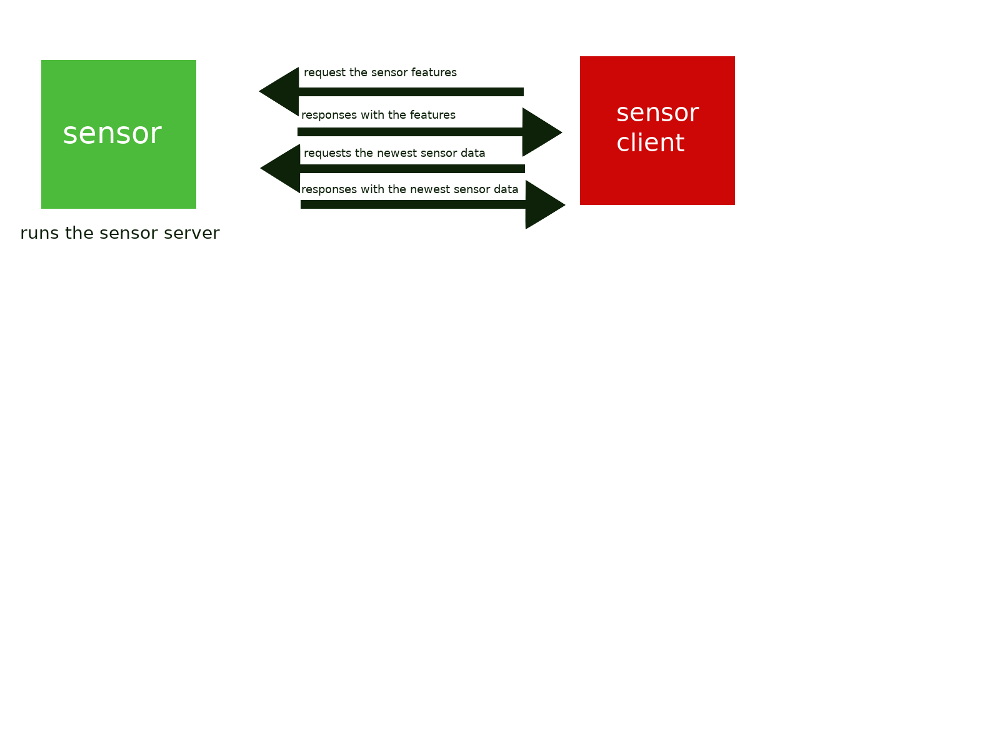

# Run an nRF52 sensor server and a client

**In this guide you set up a 6LoWPAN IoT sensor server that accepts UDP requests for data.**

## Prerequisites

- A DHT11 or DHT22 sensor
- An [nRF52832 microcontroller](set-up-nrf52-microcontroller.md) to use as a sensor server
- Either a single-board computer (SBC) such as a Raspberry Pi or a PC to use as a client
- [Configure a 6LoWPAN network](set-up-a-bluetooth-star-network.md)
- [Install the Go toolchain on either your SBC or your PC](https://golang.org/doc/install)

## Architecture

The environment sensor runs a server application. This server application uses the request-response message pattern.
The example server application opens a UDP port and waits for incoming requests on this port. 
The response will be sent back to the client on the same port the client sends a message.
One example: 
If the client (the SBC or the PC) sends an UDP packet on port 90 (outgoing-port at the SBC) to port 51037 (incoming-port on the sensor), 
the sensor will send the response to port 90 (SBC or PC).
Therefore incoming- and outgoing-port are the same on each device. 
In this example, the sensor is receiving and sending the UDP packets on port 51037,
while the client is receiving and sending packets on port 90.
Technically speaking both devices run a server in order to receive UDP packets. 
On an abstract level this design is still a request-response message pattern, 
because the sensor only responds with UDP packets when it received a correct message.
This complex design is necessary only to keep the traffic as small as possible.
UDP is a connection-less protocol. It is, compared to TCP, more efficient and more resilient.
This is exactly what we need in a lossy networks with small bandwidth. 
We might lose some packets, so we might need to send one message more than once. 
If we would use TCP, this would lead to a big overhead, due to the connection based networking.



## Run the sensor server and client

1. Connect the DHT sensor to your microcontroller
    
2. Start the server on your microcontroller
    
    :::info:
    You need to execute the following command in the serial console of your microcontroller.

    The shell terminal of your microcontroller is opened in the terminal where you executed the `make flash term` command.
    :::
    
    ```bash
    server start
    ```
    
3. Clone the client onto your Linux-based SBC or PC

    ```bash
    git clone https://github.com/iota-community/BLE-environment-sensor-client.git $GOPATH/src/github.com/citrullin/udp_client
    ```
    
4. Run the client application

    ```bash
    cd $GOPATH/src/github.com/citrullin/udp_client && go run client.go
    ```