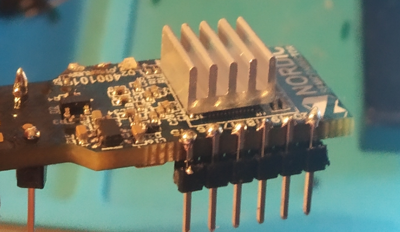

# Set up a nRF52 microcontroller
**In this guide, we are going to set up a nRF52 development board**

## Prerequisites

- nRF52832 development board
- Linux based PC
- One [Programmer](https://www.engineersgarage.com/tutorials/microcontroller-programmer-burner), internal or external: J-Link, J-Link OB clone or DAPLink

:::info
Some development boards have an integrated J-Link or DAPLink. If you have one of these boards, you don't need an additional
J-Link. Check the datasheet of your development board before.
:::

- USB-to-UART adapter
    
1. Optional: Solder JTAG pins and GPIO pins

    :::info:
    Soldering the pins on some boards is quite hard. You should keep this in mind before you buy a development board.
    Check that the development baord does not have half pin holes.
    :::

    This is not needed for every development board. Your board might has all necessary pins already soldered.
    If all pins are soldered, you can skip this part.
    
    **nRF52832 USB dongle**
    
    
    **chinese nRF52832 module + nrf52832 Minimum Test Board**
    
    
2. [Connect your Programmer and USB-to-UART adapter](connect-nrf-jlink-serial-console.md)

    :::info
    If your board has an integrated J-Link/DAPLink, you don't need to connect the J-Link to your board. 
    The J-Link/DAPLink already exposes an USB-Port. Check the datasheet of your board before.
    :::

    
    